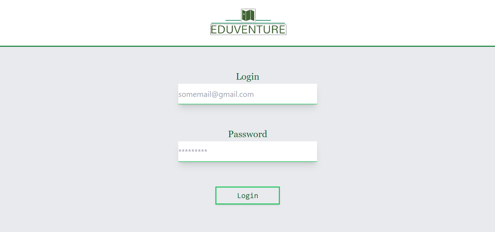
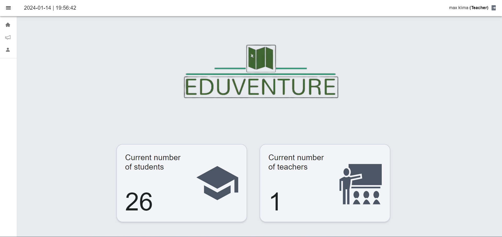
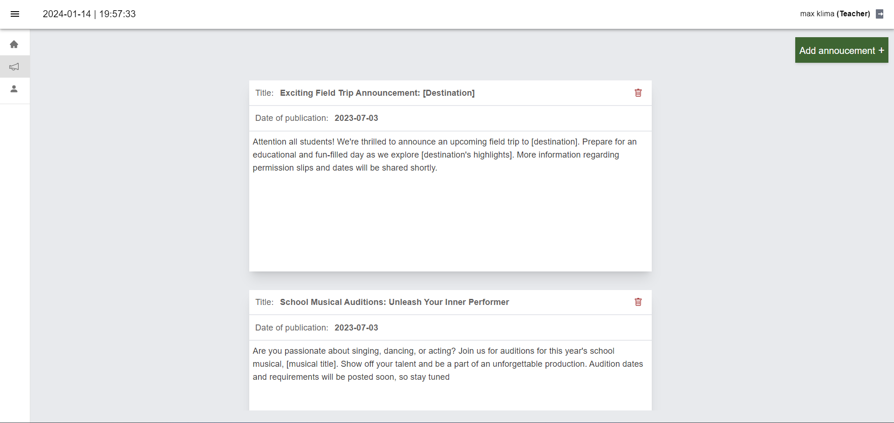
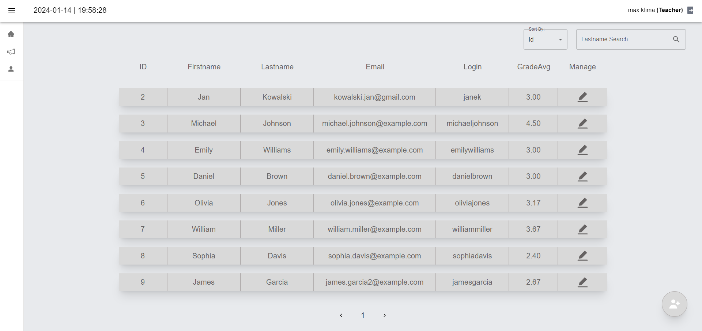
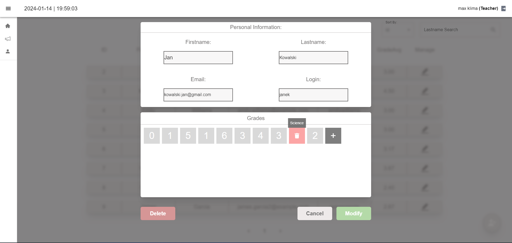
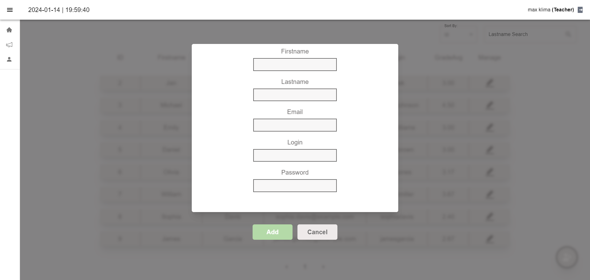
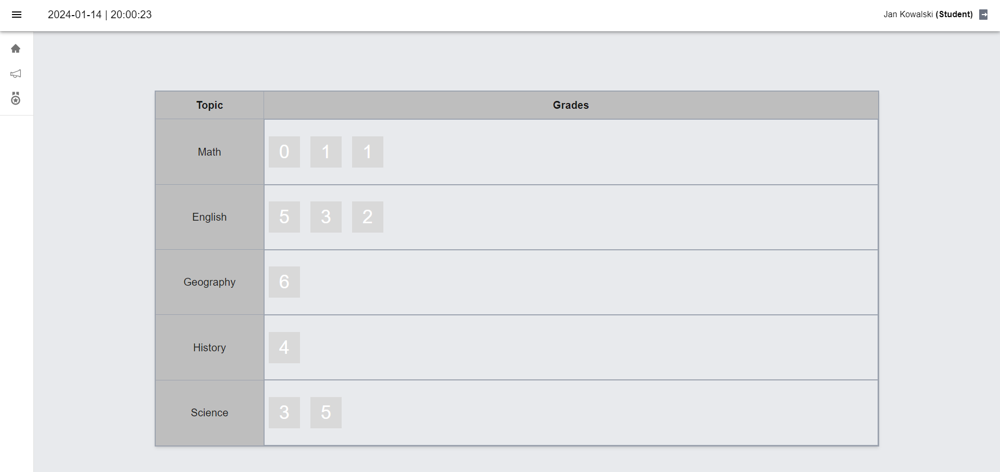

# EduVenture

EduVenture is a simple student management system built with Next.js and Spring Boot. 


## How to Run

1. **Prerequisites:**
   To run this project you will need: `NodeJs`, `JDK`, `Apache` and `mySQL server`
  
2. **Installation:**
   ```bash
   # Clone the repository
   git clone https://github.com/Maxekk/EduVenture.git

   # Navigate to the project directory
   cd EduVenture

   # Create a database and import the eduventure.sql file

   # Run api
   cd API && ./mvnw spring-boot:run

   # Install dependencies for dashboard
   cd dashboard && npm install

   # Run dashboard
   npm run dev
  App should be running on `localhost:3000`
  
 ATTENTION: You may also like to change or remove password for your database, remember to update the db password, you can do this in `EduVenture\API\src\main\resources/application.properties` file

 **Demo logins:**
 `teacher:teacher & janek:haslo123`

## Preview

   








